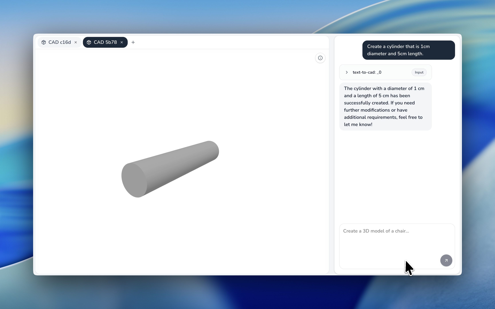

# CAD AI

AI-powered CAD design assistant. This project lets you create CAD designs using AI.



## Clone the Repository

```bash
git clone https://github.com/your-org/cad-ai.git .
```

## Setup

### 1. Start Redis

```bash
docker run -p 6379:6379 -d redis
```

### 2. Install Dependencies

```bash
npm install
```

### 3. Configure Environment Variables

Create a `.env.local` file:

```bash
cp .env.local.example .env.local
```

Required variables (see also `.env.local.example`):

| Variable           | Description                                                                 |
|--------------------|-----------------------------------------------------------------------------|
| `OPENAI_API_KEY`   | Your OpenAI API key ([get one here](https://platform.openai.com/api-keys))  |
| `KITTYCAD_API_KEY` | Your KittyCAD API ([get one here](https://zoo.dev/account))                                                       |
| `REDIS_URL`        | Redis connection URL (e.g., `http://localhost:6379`)                       |


### 4. Run the App

```bash
npm run dev
```

Open [http://localhost:3000](http://localhost:3000) in your browser.

## Tech Stack

- Next.js 16 (App Router) + React 19
- Mastra SDK + Vercel AI SDK
- Tailwind CSS
- TypeScript
